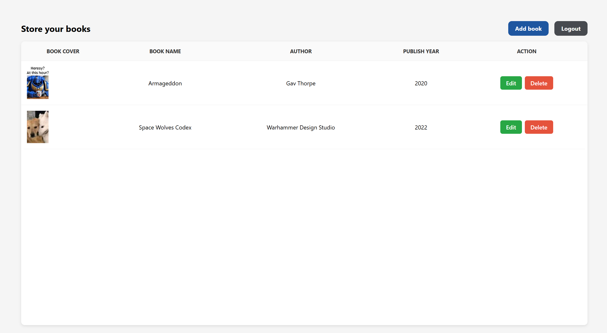
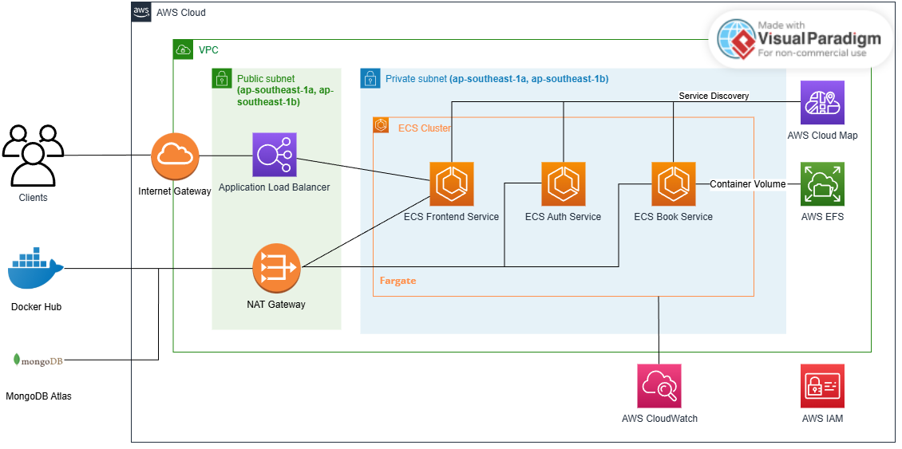

# Book Management System

This is a microservices-based web application for managing book information. The application consists of three main components:
- Authentication Service (auth-api)
- Books Service (books-api)
- React Frontend (front-end)

## Features

<p align="center">
  
  
</p>

- User authentication (signup/login)
- CRUD operations for books
- Book information includes:
  - Name (mandatory)
  - Author
  - Publish year
  - Image upload capability
- Protected routes requiring authentication
- MongoDB Atlas database integration

## Infrastructure as Code (IaC)

This project includes Infrastructure as Code by using Terraform for deploying to AWS.

<p align="center">
  
</p>

The infrastructure setup provides:
- **Amazon ECS** for containerized application deployment
- **Application Load Balancer** for traffic distribution
- **VPC with public/private subnets** for network isolation
- **CloudWatch** for monitoring and logging
- **Elastic File System** for storing book image (container volume)
- **IAM roles and policies** for secure service communication

## CI/CD with GitHub Actions

This project uses GitHub Actions for continuous integration and deployment. The workflow includes automated testing, linting, Docker image building and ECS deploying.

### Workflow Setup

To enable the GitHub Actions workflows, you need to configure the following secrets in your repository:

* `JWT_SECRET_KEY`: A secure string used for signing JWT tokens in backend services.
* `DOCKER_USERNAME`: Your Docker Hub (or other container registry) username.
* `DOCKER_PASSWORD`: Your Docker Hub password or access token.
* `AWS_ACCESS_KEY_ID`: Access key ID of your AWS IAM user with ECS deployment permissions.
* `AWS_SECRET_ACCESS_KEY`: Secret access key corresponding to the AWS IAM user.
* `ECS_CLUSTER_NAME`: Name of your ECS cluster.
* `ECS_SERVICE_NAME_AUTH`: Name of the ECS service for the `auth-api`.
* `ECS_SERVICE_NAME_BOOKS`: Name of the ECS service for the `books-api`.
* `ECS_SERVICE_NAME_FRONTEND`: Name of the ECS service for the frontend app.

**To add these secrets:**

* Go to your GitHub repository
* Navigate to: `Settings > Secrets and Variables > Actions`
* Click `New repository secret` for each item above and enter the corresponding value

### Workflow Details

The GitHub Actions workflows in this project automate the full CI/CD process, including:

* **Automated unit testing** for both backend services (`auth-api` and `books-api`) using Python
* **Frontend testing and build** with Node.js and Vite
* **Docker image build and push** to Docker Hub for all services after successful tests
* **Deployment to Amazon ECS** with updated images on the `production` branch
* **Service-specific jobs** for better isolation and debugging
* **Trigger conditions:**

  * On `pull_request` to `main` or `production` branches
  * On manual trigger (`workflow_dispatch`)
  * On `push` to `production` branch for deployment

You can customize the environment or deployment targets by adjusting secret values or modifying the workflow files under `.github/workflows/`.

## Setup and Installation

The project uses Docker Compose for easy setup and deployment. Make sure you have Docker and Docker Compose installed on your system.

1. Configure environment variables:
   - Create a .env.local file in the root directory with the following variable:
     ```bash
     JWT_SECRET=your_jwt_secret_here
     ```
   - In case of production, create .env files in `/auth-api` and `/books-api` directories:

     **auth-api/.env:**
     ```bash
     MONGODB_USERNAME=MONGODB_ATLAS_CLUSTER_USERNAME
     MONGODB_PASSWORD=MONGODB_ATLAS_CLUSTER_PASSWORD
     MONGODB_HOST=<cluster>.mongodb.net
     MONGODB_DB=users_dev
     APP_ENV=production
     ```
     
     **books-api/.env:**
     ```bash
     MONGODB_USERNAME=MONGODB_ATLAS_CLUSTER_USERNAME
     MONGODB_PASSWORD=MONGODB_ATLAS_CLUSTER_PASSWORD
     MONGODB_HOST=<cluster>.mongodb.net
     MONGODB_DB=books_dev
     APP_ENV=production
     ```

2. Build and start all services:
   ```bash
   docker compose up --build
   ```

This will start:
- MongoDB database
- Authentication service on http://localhost:5000
- Books service on http://localhost:5001
- Frontend application on http://localhost:3000 (development mode)

### Alternative Setup (Development)

If you prefer to run services individually:

#### Backend Services (auth-api and books-api)

1. Set up Python virtual environments for each service:
```bash
# For auth-api
cd auth-api
python -m venv venv
source venv/bin/activate  # On Windows: venv\Scripts\activate
pip install -r requirements.txt

# For books-api
cd ../books-api
python -m venv venv
source venv/bin/activate  # On Windows: venv\Scripts\activate
pip install -r requirements.txt
```

2. Start the services:
```bash
# In auth-api directory
python app.py  # Runs on port 5000

# In books-api directory
python app.py  # Runs on port 5001
```

#### Frontend

1. Install dependencies:
```bash
cd front-end
npm install
```

2. Start the development server:
```bash
npm run dev
```

The application will be available at http://localhost:5173 when running in development mode.

## API Endpoints

### Auth Service (http://localhost:5000)
- POST /register - Register new user
- POST /login - User login

### Books Service (http://localhost:5001)
- GET /books - Get all books for authenticated user
- POST /books - Create new book
- GET /books/:id - Get specific book
- PUT /books/:id - Update book
- DELETE /books/:id - Delete book

## Security Notes

- JWT is used for authentication
- Passwords are hashed using bcrypt
- All book operations require authentication
- Each user can only access their own books
- Services run in isolated Docker containers
- MongoDB credentials are managed through environment variables
- Environment files (.env) should never be committed to version control
- Frontend communicates with backend services through Docker network
- Volume mounts are used for development hot-reloading while maintaining container isolation
